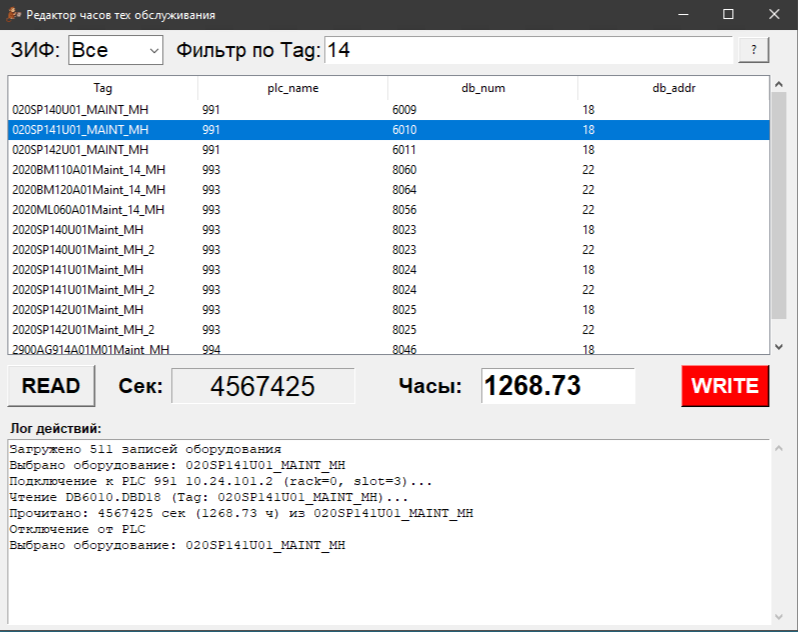

# RH Editor - Редактор часов техобслуживания



[](https://opensource.org/licenses/MIT)
[](https://python.org)
[](https://python-snap7.readthedocs.io/)

Мощное настольное приложение для корректировки часов техобслуживания промышленного оборудования, подключенного через Siemens S7 ПЛК. Создано на Python Tkinter с удобным пользовательским интерфейсом для чтения и записи значений времени техобслуживания напрямую в блоки данных ПЛК.

**Основные возможности:**
- Доступ к данным ПЛК в реальном времени для серий Siemens S7-300/400/1200/1500
- Интуитивный графический интерфейс с фильтрацией оборудования по имени тега и ЗИФ (идентификатор цеха)
- Поддержка нескольких ПЛК с индивидуальными конфигурациями
- Конфигурация на основе JSON для гибкости
- Полное логирование всех операций
- Проверка ввода с ограничением от 0 до 20 000 часов
- Кроссплатформенная совместимость (Windows/Linux/macOS)

## ✨ Основные возможности

🔍 **Умная фильтрация**
- Фильтрация оборудования по имени тега и ЗИФ (идентификатор цеха)
- Поиск в реальном времени
- Организованный список оборудования с сортировкой

⚡ **Связь с ПЛК**
- Прямая связь с Siemens S7 ПЛК (S7-300/400/1200/1500)
- Чтение/запись часов техобслуживания в формате секунд и часов
- Поддержка нескольких ПЛК с индивидуальными конфигурациями
- Проверка данных в реальном времени

🛠️ **Удобный интерфейс**
- Интуитивный графический интерфейс на базе Tkinter
- Двойной клик для чтения данных ПЛК
- Визуальная обратная связь и подробное логирование
- Встроенная система справки

📊 **Управление конфигурацией**
- Конфигурация на базе JSON для гибкости
- Простое управление оборудованием и ПЛК
- Портативные файлы конфигурации

🔒 **Функции безопасности**
- Проверка ввода (лимит 0-20 000 часов)
- Мониторинг состояния подключения
- Обработка ошибок и логирование
- Диалоги подтверждения для критических операций

## 🖥️ Обзор интерфейса

Приложение предоставляет чистый, профессиональный интерфейс с:
- Списком оборудования с возможностями фильтрации
- Чтением/записью данных ПЛК в реальном времени
- Подробным логированием действий
- Выпадающим списком выбора ЗИФ
- Конвертацией часов/секунд

## 🚀 Быстрый старт

### Предварительные требования

- Python 3.7 или выше
- Сетевой доступ к Siemens S7 ПЛК
- ПЛК должен разрешать S7 связь (порт 102)

### Установка

1. **Клонируйте репозиторий:**
   ```bash
   git clone https://github.com/SemonoffArt/rh_editor.git
   cd rh_editor
   ```

2. **Установите зависимости:**
   ```bash
   pip install -r requirements.txt
   ```

3. **Подготовьте файлы конфигурации:**
   - Убедитесь, что файлы `equips.json` и `plc.json` присутствуют
   - Настройте подключения к ПЛК и сопоставления оборудования

4. **Запустите приложение:**
   ```bash
   python mh_editor.py
   ```

## ⚙️ Конфигурация

### Конфигурация ПЛК (`plc.json`)

Определяет параметры подключения к ПЛК:

```json
{
  "plc": [
    {
      "plc_name": "PLC_ZIF1",
      "plc_addr": "192.168.1.100",
      "rack": 0,
      "slot": 1,
      "zif": 1
    },
    {
      "plc_name": "PLC_ZIF2",
      "plc_addr": "192.168.1.101",
      "rack": 0,
      "slot": 1,
      "zif": 2
    }
  ]
}
```

**Параметры:**
- `plc_name`: Уникальный идентификатор ПЛК
- `plc_addr`: IP-адрес ПЛК
- `rack`: Номер стойки ПЛК (обычно 0)
- `slot`: Номер слота ПЛК (обычно 1)
- `zif`: Идентификатор цеха для фильтрации

### Конфигурация оборудования (`equips.json`)

Сопоставляет теги оборудования с адресами блоков данных ПЛК:

```json
{
  "equips": [
    {
      "eq_name": "MOTOR_001",
      "plc_name": "PLC_ZIF1",
      "db_num": 100,
      "db_addr": 0
    },
    {
      "eq_name": "PUMP_A12",
      "plc_name": "PLC_ZIF1",
      "db_num": 100,
      "db_addr": 4
    }
  ]
}
```

**Параметры:**
- `eq_name`: Тег/идентификатор оборудования
- `plc_name`: Ссылка на конфигурацию ПЛК
- `db_num`: Номер блока данных в ПЛК
- `db_addr`: Байтовый адрес внутри блока данных (DINT = 4 байта)

## 🛠️ Использование

### Основные операции

1. **Фильтрация оборудования:**
   - Выберите ЗИФ из выпадающего списка для фильтрации по цеху
   - Используйте фильтр по тегам для поиска конкретного оборудования

2. **Чтение часов техобслуживания:**
   - Выберите оборудование из списка
   - Нажмите кнопку "READ" или дважды кликните по оборудованию
   - Просмотрите текущие часы в формате секунд и часов

3. **Запись часов техобслуживания:**
   - Введите новое значение в поле "Часы" (0-20 000)
   - Нажмите кнопку "WRITE" для обновления ПЛК
   - Подтверждающее чтение выполняется автоматически

### Расширенные возможности

- **Массовые операции:** Фильтрация по ЗИФ для работы с оборудованием конкретного цеха
- **Проверка данных:** Валидация ввода предотвращает недопустимые значения
- **Логирование:** Все операции логируются с отметками времени
- **Восстановление после ошибок:** Комплексная обработка ошибок с обратной связью пользователю

## 🔧 Разработка

### Структура проекта

```
rh_editor/
├── mh_editor.py          # Основное приложение
├── utils/
│   ├── ecs7tags2equips.py # Конвертер тегов ECS7
│   ├── ecs8tags2equips.py # Конвертер тегов ECS8
│   └── exceptions.py      # Пользовательские исключения
├── resources/
│   └── icon.ico          # Иконка приложения
├── equips.json           # Конфигурация оборудования
├── plc.json             # Конфигурация ПЛК
├── requirements.txt     # Зависимости Python
└── README.md           # Этот файл
```

### Сборка исполняемого файла

Для создания автономного исполняемого файла:

```bash
pyinstaller --onefile --windowed --icon=resources/icon.ico mh_editor.py
```

### Утилиты

Директория `utils/` содержит вспомогательные скрипты для преобразования экспортов тегов ECS в файлы конфигурации оборудования:

- `ecs7tags2equips.py`: Конвертация списков тегов ECS7
- `ecs8tags2equips.py`: Конвертация списков тегов ECS8

## 📋 Требования

- **Python:** 3.7+
- **Библиотеки:**
  - `python-snap7==2.0.2` (связь с ПЛК)
  - `tkinter` (GUI фреймворк, включен в Python)
- **Оборудование:**
  - Siemens S7 ПЛК (серии S7-300/400/1200/1500)
  - Сетевое подключение к ПЛК

## 🚨 Соображения безопасности

⚠️ **Важные замечания по безопасности:**

- Всегда проверяйте адреса ПЛК перед записью данных
- Тестируйте в безопасной среде перед производственным использованием
- Обеспечьте правильное резервное копирование данных ПЛК
- Согласовывайте с операционной командой перед внесением изменений
- Отслеживайте поведение системы после корректировки часов техобслуживания

## 🐛 Устранение неполадок

### Частые проблемы

**Сбой подключения:**
- Проверьте IP-адрес ПЛК и сетевое подключение
- Проверьте конфигурацию стойки/слота
- Убедитесь, что ПЛК разрешает S7 связь

**Ошибки конфигурации:**
- Проверьте синтаксис JSON в файлах конфигурации
- Проверьте кодировку файлов (рекомендуется UTF-8)
- Убедитесь, что сопоставления оборудования соответствуют структуре ПЛК

**Проблемы с разрешениями:**
- Убедитесь, что приложение имеет сетевой доступ
- Проверьте настройки брандмауэра для порта 102
- Проверьте настройки безопасности ПЛК

## 📄 Лицензия

Этот проект лицензирован под лицензией MIT - подробности см. в файле [LICENSE](LICENSE).

## 🤝 Участие в разработке

Вклады приветствуются! Не стесняйтесь отправлять Pull Request. Для крупных изменений сначала откройте issue для обсуждения предполагаемых изменений.

## 📞 Поддержка

Для поддержки и вопросов:
- **Email:** semonoff@gmail.com
- **GitHub:** [Issues](https://github.com/SemonoffArt/rh_editor)

## 🏷️ История версий

- **v1.0.0** (2025-05-25) - Последний релиз
  - Обновлены адреса и конфигурации ПЛК
  - Улучшена структура кода и читаемость
  - Расширены сообщения логирования для лучшей ясности
  - Обновлено для использования виртуальной среды Python 3.13

- **v1.0.0** (2024-05-25) - Первый релиз
  - Базовая связь с ПЛК
  - Фильтрация и управление оборудованием
  - GUI интерфейс с логированием

---

**Разработано 7Art © 2025**

*Профессиональные инструменты промышленной автоматизации для оптимизации техобслуживания*
